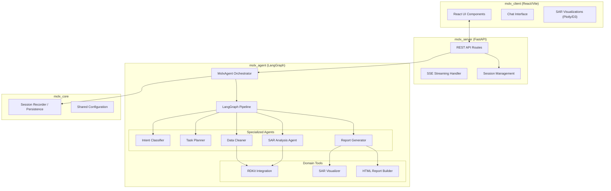

# Project Architecture

This document describes the high-level architecture of the MolX project.

## Architecture Diagram

## Component Descriptions

### 1. Frontend (`molx_client`)
- **React/Vite**: Modern frontend stack for a responsive user interface.
- **Chat Interface**: Interactive chat for users to query the SAR agent.
- **SAR Visualizations**: Interactive plots and molecular structures rendered in the browser.

### 2. Backend (`molx_server`)
- **FastAPI**: High-performance Python web framework.
- **SSE Streaming**: Supports real-time token-by-token streaming from the agent to the client.
- **Session Management**: Handles user sessions and conversation history.

### 3. Agentic Core (`molx_agent`)
- **LangGraph**: Orchestrates the multi-agent workflow as a stateful graph.
- **Orchestrator**: The entry point that manages the graph execution.
- **Specialized Agents**: Each agent handles a specific part of the SAR pipeline (e.g., cleaning data, planning tasks, generating reports).
- **Domain Tools**: Specialized tools for cheminformatics (RDKit) and visualization.

### 4. Core (`molx_core`)
- **Memory**: Provides persistence for conversation history and agent states.
- **Config**: Centralized configuration management for the entire project.
